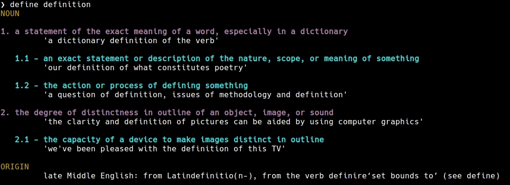

# define
[](https://circleci.com/gh/jakewarren/define)
[](https://github.com/jakewarren/define/releases])
[](https://godoc.org/github.com/jakewarren/define)
[](https://github.com/jakewarren/define/blob/master/LICENSE)
[](https://goreportcard.com/report/github.com/jakewarren/define)
[](http://makeapullrequest.com)

> A command-line dictionary app for Oxford.

This program is a hard fork of [Rican7/define](https://github.com/Rican7/define) which only provides support for the v2 Oxford API.



## Installation
### Option 1: Binary

Download the latest release from [https://github.com/jakewarren/define/releases/latest](https://github.com/jakewarren/define/releases/latest)

### Option 2: From source
If you have a working Go environment, you can install via `go get`:
```shell
go get github.com/jakewarren/define/...
```

## Configuration

Uses the configuration scheme used by [Rican7/define](https://github.com/Rican7/define).

Example `~/.define.conf.json`:
```
{
    "OxfordDictionary": {
        "AppID": "abc",
        "AppKey": "abc123"
    },
}
```

### Configuration file

A configuration file can be stored at `~/.define.conf.json` and **define** will automatically load the values specified there.

### Environment variables

Some configuration values can also be specified via environment variables. This is especially useful for API keys of different sources.

The following environment variables are read by **thesaurus**'s sources:

- `OXFORD_DICTIONARY_APP_ID`
- `OXFORD_DICTIONARY_APP_KEY`

## Acknowledgements

Very heavily based on:
* [travis-g/dict](https://github.com/travis-g/dict)
* [Rican7/define](https://github.com/Rican7/define)


## Obtaining API keys

The following are links to register for API keys for the different sources:

- [Oxford Dictionaries API](https://developer.oxforddictionaries.com/?tag=#plans)
